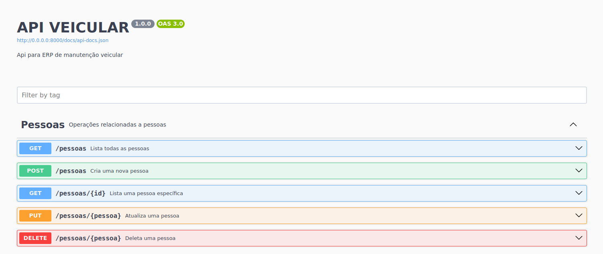
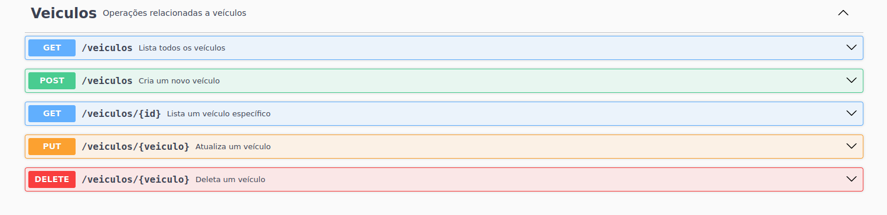
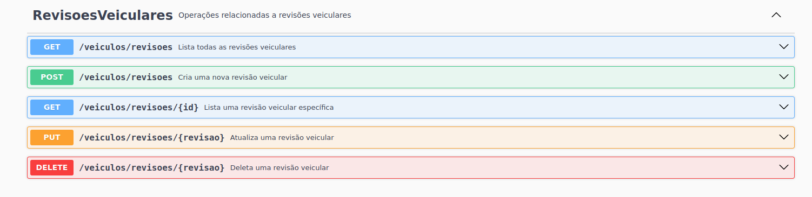
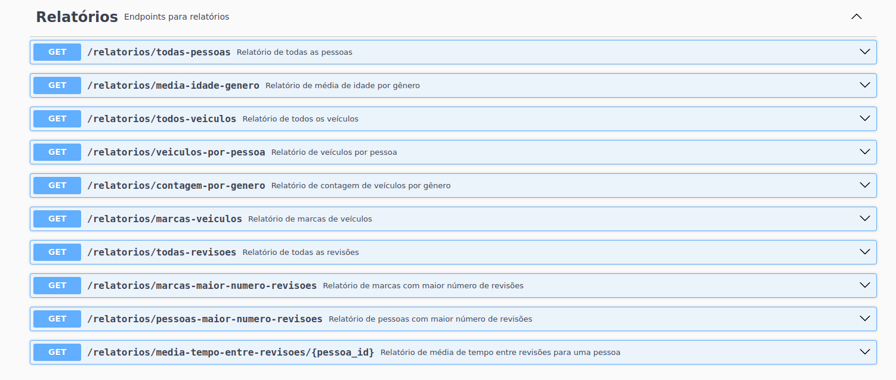
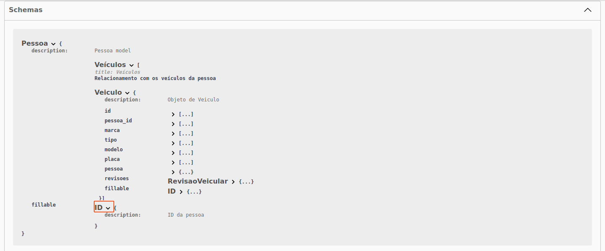
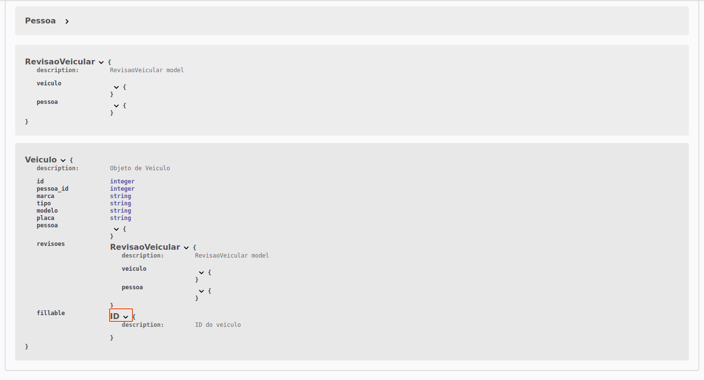

# Api Veicular

# Endpoint

## http://35.247.233.81:8080/api/

## exemplo para criar uma pessoa: 

## http://35.247.233.81:8080/api/pessoas

### {
      
### "nome": "Flavia",
### "idade": 25,
### "genero": "Feminino",
### "quantidade_veiculos": 1
      
### }

Api para ERP de manutenção veicular

